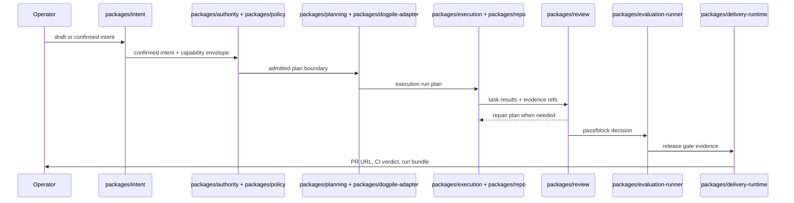

# Protostar Factory

Protostar is a dark software factory control plane: a human confirms intent, then policy-bounded automation plans, executes, reviews, repairs, evaluates, and prepares delivery evidence.

## Quickstart

Prerequisites: Node.js 22 or newer, pnpm 10, a local LM Studio server for real execution modes, and a GitHub token only when using delivery.

```sh
pnpm install
pnpm run verify
pnpm run factory -- run \
  --draft examples/intents/scaffold.draft.json \
  --out .protostar/runs \
  --planning-fixture examples/planning-results/scaffold.json
```

For a trusted real-repo run, provide a signed confirmed intent and a repo policy that grants only the target paths:

```sh
pnpm --filter @protostar/factory-cli start -- run \
  --draft examples/intents/cosmetic-tweak.draft.json \
  --trust trusted \
  --confirmed-intent .protostar/runs/<prior-run>/intent.json \
  --executor real \
  --delivery-mode gated
```

## Run Lifecycle



### Intent

Draft hardening and ambiguity scoring live in `packages/intent/src/promote-intent-draft.ts` and `packages/intent/src/ambiguity-scoring.ts`. The ambiguity threshold is `0.2`; failed drafts stop before planning and append refusal evidence through `apps/factory-cli/src/refusals-index.ts`.

### Authority

Envelope intersection lives in `packages/authority/src/precedence/intersect.ts`, with policy and archetype admission in `packages/policy/src/admission.ts`. Workspace trust and signed confirmed-intent launch are checked in `apps/factory-cli/src/two-key-launch.ts`.

### Planning

Candidate plan validation lives in `packages/planning/src/artifacts/index.ts`, and live planning pile execution is bounded through `packages/dogpile-adapter/src/run-factory-pile.ts`. The CLI wires fixture or live planning modes in `apps/factory-cli/src/main.ts`.

### Execution

Execution contracts live in `packages/execution/src/adapter-contract.ts`, while real repository writes are confined through `packages/repo/src/fs-adapter.ts` and `packages/repo/src/apply-change-set.ts`. The factory CLI composes the real executor in `apps/factory-cli/src/run-real-execution.ts`.

### Review And Repair

The review-repair loop lives in `packages/review/src/run-review-repair-loop.ts`. Mechanical checks are injected from `packages/mechanical-checks/src/create-mechanical-checks-adapter.ts`, and durable review artifacts are written through `packages/review/src/persist-iteration.ts`.

### Evaluation And Evolution

Evaluation orchestration lives in `packages/evaluation-runner/src/run-evaluation-stages.ts`, with scoring and ontology helpers in `packages/evaluation/src/compute-mechanical-scores.ts` and `packages/evaluation/src/create-spec-ontology-snapshot.ts`. Factory persistence for evolution snapshots is in `apps/factory-cli/src/evolution-snapshot-writer.ts`.

### Delivery

Delivery is gated by review authorization from `packages/review/src/delivery-authorization.ts`, with GitHub PR creation and CI capture in `packages/delivery-runtime/src/execute-delivery.ts`. The operator-facing `deliver` command is in `apps/factory-cli/src/commands/deliver.ts`.

## CLI Reference

Committed help snapshots live in [docs/cli/](docs/cli/). They are checked by an admission-e2e drift contract.

- Root help: [docs/cli/root.txt](docs/cli/root.txt)
- `run`: [docs/cli/run.txt](docs/cli/run.txt)
- `status`: [docs/cli/status.txt](docs/cli/status.txt)
- `inspect`: [docs/cli/inspect.txt](docs/cli/inspect.txt)
- `cancel`: [docs/cli/cancel.txt](docs/cli/cancel.txt)
- `resume`: [docs/cli/resume.txt](docs/cli/resume.txt)
- `deliver`: [docs/cli/deliver.txt](docs/cli/deliver.txt)
- `prune`: [docs/cli/prune.txt](docs/cli/prune.txt)

## Run Bundle

See [docs/run-bundle.md](docs/run-bundle.md) for the artifact tour and [docs/run-bundle.appendix.md](docs/run-bundle.appendix.md) for generated JSON Schema.

## Packages

Per-package READMEs land in Phase 10 Plan 05. The public package set includes `packages/intent`, `packages/planning`, `packages/execution`, `packages/review`, `packages/evaluation`, `packages/evaluation-runner`, `packages/delivery`, `packages/delivery-runtime`, `packages/policy`, `packages/authority`, `packages/artifacts`, `packages/repo`, `packages/repair`, `packages/mechanical-checks`, `packages/dogpile-adapter`, `packages/dogpile-types`, `packages/fixtures`, `packages/paths`, and `apps/factory-cli`.

## Security

See [SECURITY.md](SECURITY.md) for trust assumptions, capability-envelope boundaries, secret handling, and reporting instructions.
